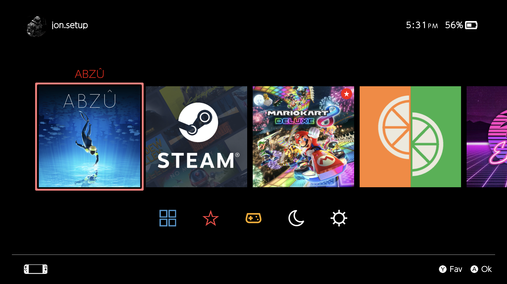
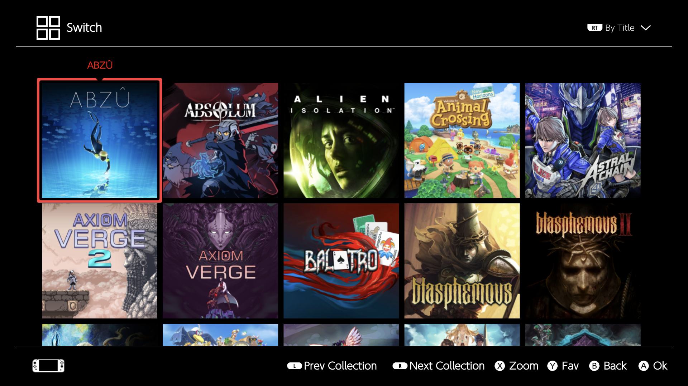

# skylineOLED

<p align="center">
  
  
  
  
  
</p>
<p align="center">
  
  
   
   
  
   </p>
</p>

<p align="center">
  <b>A premium OLED-optimized theme for Pegasus Frontend.</b><br/>
  High contrast • Clean layout • Fast navigation
</p>

---

## 📸 Screenshots

<p align="center">
  <b>Captured on AYN Odin 2 Portal</b>
</p>

<p align="center">
  <!-- Replace the image URLs below with your actual screenshots -->
  
  &nbsp;&nbsp;
  
</p>

<p align="center">
  <i>All screenshots were taken on an <b>AYN Odin 2 Portal</b> device to showcase the OLED contrast and UI clarity.</i>
</p>

---

## ✨ Overview

**skylineOLED** is a modern visual theme for **Pegasus Frontend**, designed specifically for **OLED displays**.  
It focuses on deep blacks, high contrast, and a clean interface to deliver a sleek and immersive frontend experience.

---

## 🚀 Features

- 🖤 **OLED-first design** – true blacks and high-contrast UI  
- ⚡ **Fast navigation** – optimized screen layers and lists  
- 🧩 **Modular structure** – reusable components and clean QML  
- ⭐ **Built-in actions** – Favorites, OK, Back, and custom interactions  
- 🎮 **Game-focused UX** – Recent, Favorites, Most Played, and more  

---

## 🗂 Project Structure
```text
skylineOLED/
├─ theme.qml            # Main theme entry point
├─ theme.cfg            # Theme metadata and user settings
├─ layer_home.qml       # Home screen UI
├─ layer_grid.qml       # Game grid view
├─ layer_settings.qml   # Settings screen
├─ Lists/
│  ├─ Recent.qml        # Recently played list
│  ├─ Favorites.qml     # Favorite games
│  └─ MostPlayed.qml    # Most played games
├─ global/
│  ├─ Button.qml        # Reusable button component
│  ├─ Header.qml        # Top bar / title component
│  └─ Footer.qml        # Action hints and navigation
└─ utils.js             # Shared helper functions
```
--- ---

## 📦 Requirements

- **Pegasus Frontend**  
- Compatible QML/Qt version supported by Pegasus

---

## ⚙️ Manual Theme Installation (Pegasus Frontend)

Follow the steps below to install the theme manually in Pegasus Frontend.

### 1️⃣ Locate the Pegasus Themes Directory

Depending on your operating system, the themes folder is usually located at:

- **Windows:**  
  C:\\Users\\<your-username>\\AppData\\Local\\pegasus-frontend\\themes

- **Linux:**  
  ~/.config/pegasus-frontend/themes

- **macOS:**  
  ~/Library/Application Support/pegasus-frontend/themes

If the themes folder does not exist, create it manually.

---

### 2️⃣ Copy the Theme Folder

Extract the repository and copy the entire theme folder:

> ⚠️ Important: Do not rename or nest the folder (e.g., themes/skylineOLED/skylineOLED/).  
Pegasus must find theme.qml directly inside the theme directory.

---

### 3️⃣ Select the Theme in Pegasus

1. Launch **Pegasus Frontend**.
2. Open **Settings**.
3. Go to **User Interface / Theme**.
4. Select **skylineOLED** from the list.
5. Apply and return to the main screen.

---

### 4️⃣ Restart (If Needed)

If the theme does not appear immediately:
- Close Pegasus completely.
- Reopen the application.

---

### 🛠 Troubleshooting

**Theme does not appear in the list**
- Verify the folder structure:  
  themes/skylineOLED/theme.qml must exist.
- Make sure there are no extra nested folders.

**Visual elements not loading**
- Check for missing files or case-sensitive filenames (important on Linux).
- Ensure your Pegasus version supports the QML/Qt features used by the theme.

**Navigation or buttons not working**
- Reset to the default theme.
- Reapply skylineOLED and restart Pegasus.

---

### ✅ Installation Complete

Once selected, **skylineOLED** will immediately replace the interface with an OLED-optimized, high-contrast layout.

Enjoy your new theme.
---

## 🛠 Development Notes

This theme follows a **layer-based UI architecture**, where each screen is isolated into a layer_*.qml file.  
Common elements (buttons, labels, hints) live inside the global/ directory for reuse and maintainability.

---

## 🤝 Contributing

Contributions are welcome.

- Open an **issue** for bugs, suggestions, or feature requests.
- Submit a **pull request** for improvements or fixes.
- For major changes, please discuss them first via an issue.

---

<p align="center">
  <b>skylineOLED</b><br/>
  A dark, elegant and OLED-optimized experience for Pegasus Frontend.
</p>
